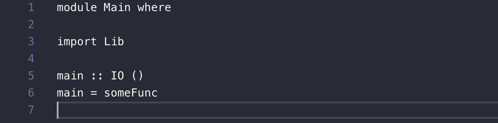
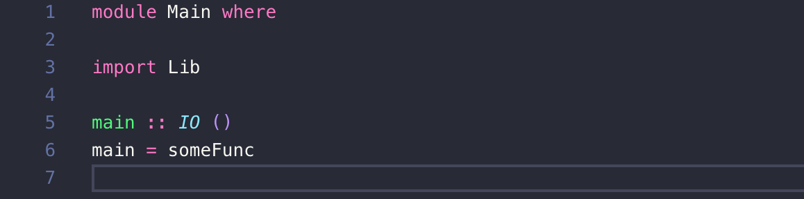
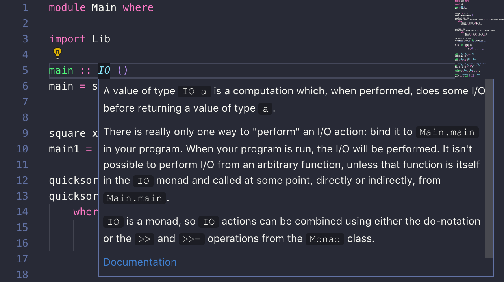

# VS Code Haskell 개발환경 세팅

Haskell with VS Code in MacOS

## Haskell Download
[하스켈 홈페이지](https://www.haskell.org/downloads/)에 보면 하스켈을 다운로드하는 방법이 총 3가지가 있다.

1. [Minimal installers](https://www.haskell.org/downloads/#minimal)
2. [Stack](https://www.haskell.org/downloads/#stack)
3. [Haskell Platform](https://www.haskell.org/downloads/#platform)

이 중, `Stack`으로 설치하려고 한다.

> [하스켈 학습 가이드](https://github.com/bitemyapp/learnhaskell/blob/master/guide-ko.md), [Haskell 스터디 Part.01](http://blog.weirdx.io/post/57879)를 참고하여 Stack으로 결정


## The Haskell Tool Stack
`Stack`이란 하스켈의 크로스 플랫폼 빌드 도구이다. `Stack`을 통해서 하스켈을 비교적 쉽게 시작할 수 있다.

## Stack Download
[홈페이지](http://docs.haskellstack.org/en/stable/install_and_upgrade/#os-x)에서 소개하는 몇 가지 방법 중, `homebrew`를 통해 설치한다.

터미널에 다음과 같이 입력한다.
```bash
$ brew install haskell-stack
```

## Create Project
이제 프로젝트를 생성해보자.
```bash
$ stack new my-project && cd my-project
```

`my-project`라는 디렉토리 안에 프로젝트의 뼈대가 구성된다.

## Compiler Download
```bash
$ stack setup
```
`stack setup` 은 컴파일러를 **격리된 위치**로 다운로드하여, 시스템의 다른 `Haskell`의 설치에 대해 영향을 주지 않는다.
> `stack path` 명령어를 통해 설치 경로를 볼 수 있다.


## VS Code를 단순한 Editor에서 IDE로 바꾸기
VS Code를 켜보자.
```bash
$ code .
```



위와 같이 코드를 보면 밥맛이 뚝 떨어지고 그저 속상하다.

### Syntax Highlighting
`Haskell Syntax Highlighting` Extension을 다운로드한다.



좋다.

### Linting
`haskell-linter` Extension을 다운로드한다.

다운로드를 하면 이와 같은 메시지를 보게 될 것이다.


추가로 다운로드가 필요하다.
```bash
$ stack install hlint
```

`export PATH=$PATH:~/.local/bin`을 각자 환경에 맞게 `.bash_profile`이나 `.bashrc`, `.zshrc`에 추가해준다.

VS Code를 종료하고 다시 키면 lint가 작동하는 것을 확인할 수 있다.

### Language Server
[Haskell Language Server](https://marketplace.visualstudio.com/items?itemName=alanz.vscode-hie-server)은 다양한 기능을 갖고 있다.
- 모던한 개발 환경
- 타입 정보
- 함수 정의
- jump to definition
- 대소문자 구분

하지만 마켓에서 제공하는 것은 **클라이언트** 뿐이다. 즉, 서버와 이어주는 역할만 해주는 것이기 때문에 **서버를 따로 설치**해야 한다. Language Server인 [haskell-ide-engine](https://github.com/haskell/haskell-ide-engine)을 설치하도록 한다.

#### haskell-ide-engine
하스켈의 `Language Server` 중 가장 큰 커뮤니티와 높은 완성도를 갖고 있다.

먼저 컴파일러의 버전을 확인한다.
```bash
$ stack ghc -- --version
The Glorious Glasgow Haskell Compilation System, version 8.6.5
```

확인했으니 설치한다.
```bash
$ cd ..
$ git clone https://github.com/haskell/haskell-ide-engine --recurse-submodules && cd haskell-ide-engine
```

8.6.5 버전의 컴파일러에 맞는 haskell ide engine 버전을 설치해야 한다. 그런데 [haskell-ide-engine 레파지토리](https://github.com/haskell/haskell-ide-engine#install-specific-ghc-version)를 확인해보면 8.6.4가 최신인 것을 알 수 있다. 고로 8.6.4 버전을 설치한다.

정말 오래 걸린다.
```bash
$ stack ./install.hs hie-8.6.4
$ stack ./install.hs build-data
```
> 정확하게 확인은 못했지만 `hie-8.6.5`를 설치해도 `hie-8.6.4`가 설치되는 것으로 보인다.

설치가 완료되면 `Haskell Language Server` Extension을 설치해준다.



위와 같이 `Language Server`가 제공하는 IO 모나드에 대한 정보를 볼 수가 있다.

# Reference
[Setting up Haskell in VS Code on macOS](https://medium.com/@dogwith1eye/setting-up-haskell-in-vs-code-on-macos-d2cc1ce9f60a)

[haskell-ide-engine](https://github.com/haskell/haskell-ide-engine)

[Visual studio code 에서 haskell 개발환경 세팅하기 (Haskell-Ide-Engine) (os x)](https://ingun37.wordpress.com/2019/06/19/visual-studio-code-%EC%97%90%EC%84%9C-%EC%99%84%EB%B2%BD%ED%95%9C-haskell-%EA%B0%9C%EB%B0%9C%ED%99%98%EA%B2%BD-%EC%84%B8%ED%8C%85%ED%95%98%EA%B8%B0-haskell-ide-engine/)

[Haskell 스터디 Part.01](http://blog.weirdx.io/post/57879)

[하스켈 학습 가이드](https://github.com/bitemyapp/learnhaskell/blob/master/guide-ko.md)

[하스켈 홈페이지 다운로드](https://www.haskell.org/downloads/)

[Stack Documentation](https://docs.haskellstack.org/en/stable/README/)

[LSP(Language Server Protocol) 간단 설명](https://neurowhai.tistory.com/306)