# 왜 TypeScript가 좋을까?

> TypeScript 도입 이유에 대해 찾아보다가 발견한 [[10회-2]TypeScript와 Flow: 자바스크립트 개발에 정적 타이핑 도입하기](https://www.youtube.com/watch?v=H16gTwa2J7g&feature=youtu.be&t=0s) 발표영상을 보고 정리한 글입니다.

## 정적 타이핑을 쓰면 좋은 점

### 버그를 발견하는 시점을 앞당길 수 있다.

흔한 프로그래밍 파이프라인은 다음과 같다.

코드 수정 -> 컴파일 or 트랜스파일 -> 커밋 -> PR -> 빌드 -> 배포

하지만 어느 단계에서 버그를 발견하느냐에 따라 처리 비용이 달라진다.

혼자 코딩을 하다가 발견했을 경우 그냥 고치면 된다. 하지만 그 버그가 PR 후에 동료의 리뷰를 받으며 발견됬을 경우, 리뷰어와 리뷰를 반영하는 비용이 발생한다. 심지어 배포가 된 후 사용자가 버그 제보를 해서 발견된 경우는 장애 상황에 속하며, 이전 상황에 비해 비교도 안될만큼 처리 비용이 많이 들게 된다.

정적 타입 시스템이 빛나는 지점이 바로 여기다. 정적 타입 시스템을 이용하면 **PR, 빌드, 배포** 단계에 있던 버그들을 **코드 수정, 컴파일 or 트랜스파일, 커밋** 단계로 가져올 수 있게 된다.

다음은 국제 소프트웨어 엔지니어링 컨퍼런스에서 발표된 논문이며, 자바스크립트에 정적 타입 시스템 도입 시 효과에 대한 연구이다.

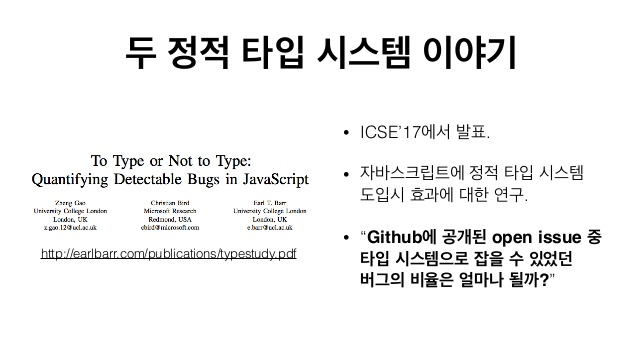

GitHub에는 코드, 커밋 로그, PR 등 많은 정보들이 있다. 이를 통해 **버그**와 **버그가 고쳐진 커밋**을 연관지을 수 있다. 즉 버그 Fix 직전의 커밋으로 돌아갔을 때에는 버그가 살아있었을 것이며, 해당 상태에서 정적 타입 시스템을 도입했을 때 타입 체커가 버그를 알려준다면 해당 버그는 **타입 시스템으로 잡을 수 있었던 버그**라고 할 수 있다.

해당 연구를 통해 다음과 같은 결과가 도출되었다.

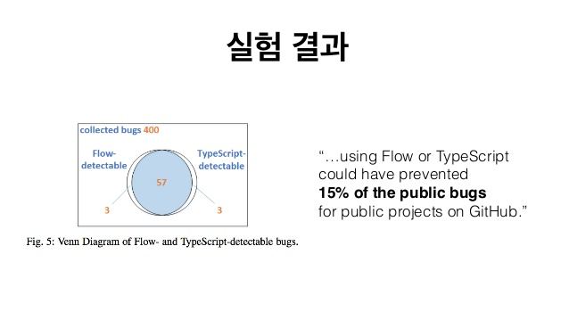

400개의 버그 중에 60개 정도, 즉 **15% 정도**를 예방할 수 있었다.

버그가 사라지는 것은 아니다. 발견 시점이 앞당겨지는 것이다. 하지만 유저가 리포트한 버그의 15%를 줄일 수 있다면 사실상 굉장한 것이다.

### 코드와 더 밀접하게 연결된 문서화가 가능해진다.

타입으로 이루어진 주석은 타입 체커가 항상 검사하기 때문에, 코드의 실제 동작과 다를 경우가 현저히 줄어든다. 

### 리팩토링이 용이해진다.

변수명, 코드의 구조, 파일 등을 바꿨을 때 타입 시스템이 고칠 부분들을 알려준다. 그리고 그 부분들을 고치면 리팩토링이 끝난다.

## 좋은 건 알겠고, 정적 타입 시스템은 어떤 선택지가 있나요?

수많은 다양한 선택지가 있지만, 대부분의 경우 생태계와 커뮤니티 파워가 부족하다는 이유로 배제되며 결국 다음과 같이 2개 사이에서 고민하게 된다.

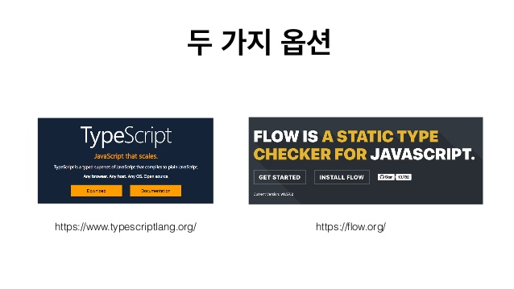

TypeScript, Flow 모두 기존의 JavaScript 코드와 함께 점진적으로 개선하기 쉽다는 장점을 갖고 있다. 비교해보자면 다음과 같다.

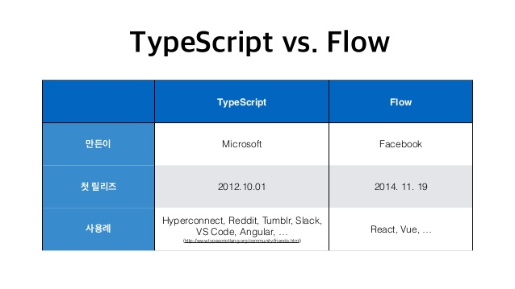

둘다 거대한 회사가 뒤를 봐주고 있다.

### 문법이 기본적으로 거의 비슷하다.

이를 통해 알 수 있는 점은, 두 언어 모두 같은 선배를 보며 배웠으며 서로 영향을 주고 있다는 것이다.

### 그래서 무엇을 써야 하나...?

주로 TypeScript와 Flow 둘 다 훌륭한 도구이며, 둘의 장단점을 파악해 프로젝트의 성격에 맞는 도구를 잘 골라쓰라는 답변들이 많다.

하지만 이러한 답변들은 **틀리기도 힘들지만, 실제로 도움이 되기도 힘든 답변**들이다.

## TypeScript를 쓰는 것을 추천한다.

TypeScript를 쓰는 것을 추천하며, 그 이유는 다음과 같다.

### 안전함과 편리함 사이의 설득력 있는 트레이드 오프

TypeScript와 Flow는 '**JavaScript에 정적 타입 시스템을 도입해서 코드를 잘 짜보자.**'라는 큰 목표는 분명 같다. 하지만 접근법이 조금 다르다. 다음은 TypeScript의 Design Goals & Non-Goals 중 하나인데, **Non-Goals**에 관한 얘기이다.. 즉, **TypeScript의 목표가 아닌 것**을 말하는 것이다.

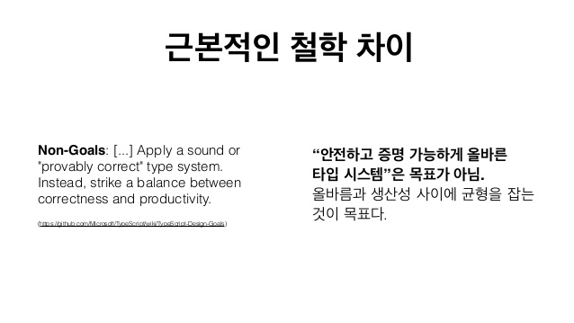

다음은 Flow의 문서에 있는 **Flow의 목표**에 대한 내용이다.

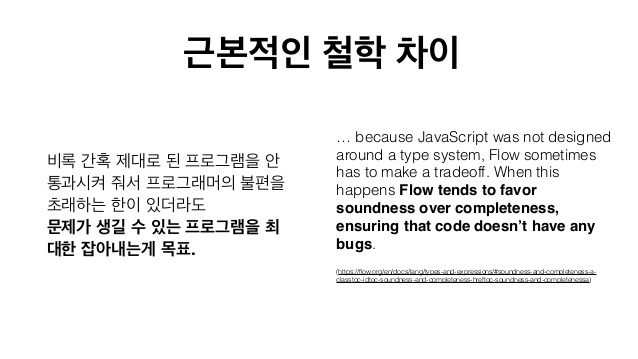

쉽게 말해, TypeScript는 '안전한 것은 목표가 아니다'라고 말하며 Flow는 '안전한 것이 최고다'라고 말한다. 그래서 **안전함과 프로그래머의 사용성 사이에서 트레이드 오프가 발생**할 때, 어떤 곳에 우선 순위를 두는 지에 대해서 의견이 갈린다.

다음과 같은 Flow의 코드를 살펴보도록 하자.

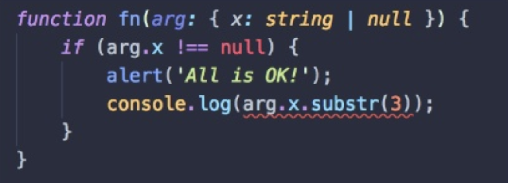

아무런 문제가 없어 보인다. 하지만 다음과 같은 (현실에는 있기 힘든) 상황이라면 얘기가 다르다.

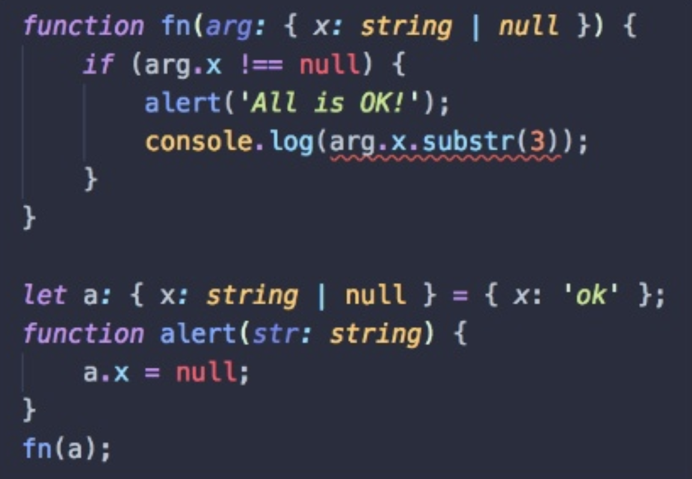

`alert` 함수가 재정의될 수 있는 여지가 있기(?) 때문에, 분명 첫번째 if문에서 null 체크를 해줬음에도 불구하고 `console.log()`에서 한번더 null 체크를 해줘야 한다. 하지만 현실에서 이와 같이 코드를 짤 일은 없으며, 그로 인해 극도의 안전함을 추구하는 Flow의 타입 체커는 **큰 실익 없이 짜증만을 유발**하는 경우가 많다.

#### Flow의 안전성은 공짜가 아니다!

- 언어적 특성 상 JavaScript 코드에는 항상 나쁜 짓을 할 구석이 숨어있다.
    - 예를 들어 `const`로 정의한 변수도 재할당이 불가능할 뿐, 대부분의 객체가 가변이다. `pop()`, `push()` 등 다 가능하다.
- 그렇기 때문에 Flow에서 제공하는 안전성을 보장받으려면 사용자가 몹시 많은 체크를 감당해야 한다.
    - 방금 전에 봤던 코드에서 if문으로 null 체크를 하는 경우와 같다.
- 이러한 '안전한 선택'이 보일러 플레이트 코드로 돌아온다.
- 심지어 오히려 흔한 실수를 잡아주지 못하는 경우도 존재한다.

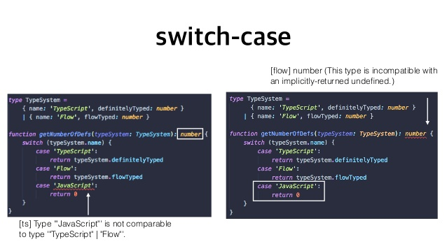

> 왼쪽이 TypeScript, 오른쪽이 Flow이다.

`TypeSystem` 인자를 받아서 `number`을 산출하는 `getNumberOfDefs` 함수가 있다. 이와 같은 경우에서, `TypeScript`, `Flow`와 같이 가능한 타입 모두를 처리했기 때문에 가능한 두 가지의 경우를 다 처리했다는 것을 알고 있다.

TypeScript의 버그 체커는 `JavaScript`를 체크하고 있는데, 이와 같은 경우는 **대부분 프로그래머가 오타를 냈거나 실수한 경우**이다.

반면 Flow의 버그 체커는 `number`을 체크하고 있다. 반환값이 `number`인데 암묵적으로 `undefined`를 반환하고 있다, 즉 `default`가 없기 때문에 `undefined`를 반환할 수도 있다는 것을 말하고 있다. 오히려 `JavaScript`라는 잘못된 경우를 너그럽게(?) 허용하는 것을 볼 수 있다. 결국 안전함에 대한 보장을 사용자가 부담해야 하는 상황이 생긴다.

### 훌륭한 IDE 서포트 (VS Code)

VS Code는 컨트리뷰터 수가 1위인 굉장히 활발한 프로젝트이다.

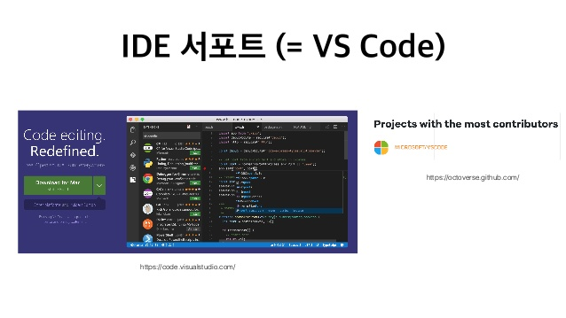

VS Code의 대문 사진(?)인데 코드가 TypeScript이다. TypeScript를 굉장히 편애하는 프로젝트인 것이다!

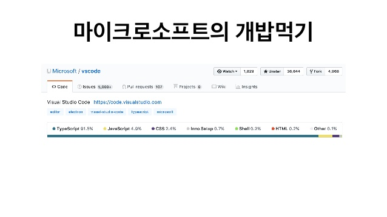

- VS Code와 TypeScript는 상생 관계이다.
    - VS Code의 91% 정도가 TypeScript로 짜여져 있다.
    - 실제로 VS Code와 TypeScript의 릴리즈 노트를 보면 아예 같은 내용이 많다.
- VS Code라는 아주 복잡한 어플리케이션이 TypeScript로 짜여져 있다는 사실 자체가 하나의 **보증**이다.

또한 수많은 기능이 존재한다.

### 훨씬 거대한 커뮤니티

다음은 2017.09.28 기준의 통계이다.

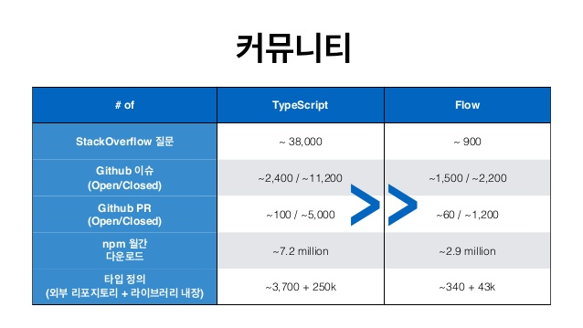

**TypeScript의 커뮤니티 파워가 압도적**인 것을 확인할 수 있다.

앞서 말한 것과 같이 JavaScript의 정적 타입 시스템을 고민할 때, 주로 크게 TypeScript와 Flow를 두고 고민한다. 그래서 TypeScript와 Flow가 동등한 입지로 생각될 수 있지만, 실제로 사용할 때 TypeScript 커뮤니티의 무게감은 상당하다.

## Conclusion

- 정적 타이핑을 통해 코드의 가독성과 안정성을 높일 수 있고, 더 빠른 개발이 가능해진다.
- 많은 선택지들 중 TypeScript를 추천한다.
- 합리적 트레이드 오프, 훌륭한 개발 환경, 거대한 커뮤니티를 갖췄기 때문이다.

# Reference
[[10회-2]TypeScript와 Flow: 자바스크립트 개발에 정적 타이핑 도입하기](https://www.youtube.com/watch?v=H16gTwa2J7g&feature=youtu.be&t=0s)