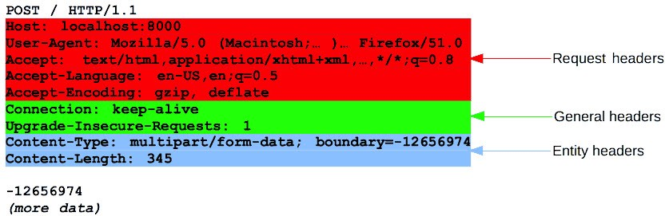

# HTTP

**HTTP**(Hypertext Transfer Protocol)은 웹 브라우징에 사용되는 통신 프로토콜이다. 이 프로토콜은 클라이언트가 HTTP 요청을 보내고 서버가 브라우저에 표시될 리소스를 응답하는 방식의 메시지 기반의 방식을 사용한다.

#### 모든 HTTP 통신은 요청과 응답을 포햠한다. 그 특성상, HTTP는 stateless하다.

**stateless**는 모든 요청이 다른 요청과 분리되어 있기 때문에 스스로 요청을 만족시키는 충분한 정보가 포함되어 있어야 한다. 즉, stateless하다는 것은 HTTP 기반의 각 메시지의 처리는 각각 개별적으로 처리된다는 것을 의미한다.

## URL
**URL**(Uniform Resource Locator)은 아마도 가장 잘 알려진 웹의 개념일 것이다. 또한 가장 중요하고 유용한 개념이기도 하다. URL은 웹 상의 자원(resource)을 찾기 위해 사용하는 고유한 주소이다.

> 웹에 대한 아이디어는 자원을 중심으로 구성되었다. 웹의 출발점이 text/HTML 파일, 문서, 이미지 등 자원을 공유하기 위한 플랫폼이었다.


#### Protocol
대부분의 경우 **HTTP** 혹은 **HTTPS**이다. 

알아둘만한 다음과 같은 프로토콜이 있다.
- **FTP**(File Transfer Protocol)
    - 네트워크를 통해 클라이언트와 서버 사이에 파일 전송을 위한 표준 프로토콜이다. 
- **SMTP**(Simpel Mail Transfer Protocol)
    - 이메일 전송을 위한 표준 프로토콜이다.

#### Domain
자원이 위치하고 있는 하나 이상의 IP 주소를 나타내기 위한 이름이다.

#### Path
서버 상에 위치한 리소스의 위치를 명시한다. 이 글을 읽는 디바이스에서 사용하는 자원 위치와 같은 로직을 사용한다.

#### Parameters
자원을 나타내거나 필터링하는 등의 추가적인 데이터이다.

## HTTP Requests
HTTP에서 모든 요청은 URL 주소를 갖는다. 추가적으로 요청은 메소드가 필요하다. 다음과 같은 행위를 하는 4가지의 메인 메소드가 있다.

- **GET** : read
- **PUT** : update
- **POST** : create
- **DELETE** : delete

**HTTP Methods** 섹션에서 더 다뤄보려고 한다.

모든 HTTP 메시지는 1개 이상의 헤더와 메시지 바디(생략 가능)를 가진다. 바디는 요청과 함께 보내질 데이터 또는 응답과 함께 받을 데이터를 포함한다.

모든 HTTP 요청의 첫 부분은 다음과 같은 3가지 요소를 포함한다.

```
GET /adds/search-result?item=vw+beetle HTTP/1.1
```

URL에 `?`이 있는 것은 쿼리를 포함한다는 뜻이다. 즉, 요청된 자원의 파라미터를 보낸다는 뜻이다.

1. 첫번째 부분은 어떤 HTTP 메소드가 쓰였는지 말해주는 것이다. `GET` 메소드가 가장 많이 쓰인다. `GET` 메소드는 웹 상의 자원을 가져오며, `GET`은 메시지 바디를 갖지 않는다.
2. 두번째 부분은 요청된 URL이다.
3. 세번째 부분은 HTTP 버전이다. `1.1` 버전이 브라우저에서 가장 보편적인 버전이다. 하지만 `2.0` 버전이 대체하는 중이다.

HTTP request는 다음과 같은 것들도 포함한다.

#### Referer header
요청이 어떤 URL로부터 왔는지 말해준다. 즉, 현재 요청된 페이지의 링크 이전의 웹 페이지 주소를 포함한다. 사람들이 어디로부터 와서 웹을 방문 중인지 인식할 수 있도록 해주며, 해당 데이터는 분석, 로깅, 혹은 캐싱 최적화에 사용될 수도 있다.

#### User-Agent header
요청을 보낸 브라우저에 대한 추가적인 정보를 포함한다. 즉, 현재 사용자가 어떤 클라이언트(운영체제 or 브라우저 등)를 이용해 요청을 보냈는지 나온다.

#### Host header
고유한 호스트 이름을 나타낸다. 같은 서버에 동일한 웹 페이지가 호스팅되어 있을 경우 꼭 필요하다.

#### Cookie header
클라이언트에게 추가적인 파라미터(쿠키)를 보낸다.

## HTTP Responses
HTTP request와 같이 HTTP response는 세가지 요소로 구성되어 있다.

```
HTTP/1.1 200 OK
```

1. 첫 번째 부분은 사용되고 있는 HTTP 버전을 나타낸다.
2. 두 번째 부분은 요청 결과에 대한 숫자 코드이다.
3. 세 번째 부분은 두 번째 부분에 대한 글자로 된 설명이다.

HTTP response는 다음과 같은 것들도 포함한다.

#### Server header
어떤 웹 서버 소프트웨어가 사용되는지에 대한 정보이다.

#### Set-Cookie header
브라우저에게 쿠키를 발행한다.

#### Message body
일반적으로 HTTP response는 메시지 바디를 갖는다.

#### Content-Length
메시지 바디의 바이트 단위 길이를 말해준다.

## HTTP Methods

가장 보편적인 메소드는 `GET`과 `POST`이며, 다음과 같은 메소드들이 있다.

- **GET**
    - `GET` 요청은 자원이 수정되지 않는 데이터를 요청하는 데 사용된다. 즉, `GET` 요청은 자원 상태를 변경하지 않는다.
- **POST**
    - 생성할 자원에 대한 정보를 서버에게 전송한다.
- **PUT**
    - 서버에 이미 존재하는 자원을 수정할 때 사용하며, 요청의 바디에 수정할 내용을 보낸다.
- **HEAD**
    - `GET` 메소드와 같은 함수이지만 한가지 차이점이 있는데, response에 바디가 포함되지 않는다는 점이다. 하지만 `GET` 메소드를 썼을 때와 동일한 헤더를 포함한다. `HEAD` 메소드는 `GET` 요청을 하기 전에 자원이 있는지 확인하기 위해 사용된다.
- **TRACE**
    - 진단 목적으로 설계된 메소드이다. 응답에는 바디에 요청 메시지의 정확한 내용이 포함된다.
- **OPTINS**
    - 대상 자원에 사용 가능한 통신 옵션(HTTP 메소드)들을 명시하기 위해 쓴다.
- **PATCH**
    - 자원에 부분적인 수정을 적용하는데에 사용된다.
- **DELETE**
    - 특정한 자원을 삭제하는 데에 사용된다.


## REST
**REST**(Representational State Transfer)은 시스템 자원에 대한 현재 상태의 표현을 포함하는 요청과 응답에 대한 아키텍쳐 스타일이다.

#### "일반적인" 스타일
`http://carapp.com/search?make=wv&model=beetle`

#### REST 스타일
`http://carapp.com/search/vw/beetle`

> REST API에 대해서는 여타 좋은 자료들이 많으니 참고하면 좋을것 같다.

## HTTP Headers

요청/응답 구조의 3가지 주요 요소가 있다.
- First line
- Headers
- Body/Content

이번에는 HTTP 헤더에 대해 얘기해보려고 한다.

HTTP 헤더는 첫줄 다음에 추가되며, `:`(colon)으로 구분된 값 쌍으로 정의된다. HTTP 헤더는 요청과 응답의 추가적인 파라미터를 보내는데 쓰인다.

우리가 이미 말했듯이, 바디의 메시지는 요청과 함께 보내져야할 데이터 혹은 응답과 함께 받는 데이터를 포함한다.

헤더는 어떻게 사용되는지에 따라 4가지의 카테고리로 나눠진다.

- **General header** : 요청과 응답 둘 다의 메시지에 쓰일 수 있는 헤더이다. 데이터가 교환되는 것과는 상관없다.
- **Request header** : 데이터 요청의 파라미터를 정의하거나 클라이언트의 요청 생성에 관한 중요한 정보를 주는 파라미터를 정의한다.
- **Response header** : 받을 응답에 대한 정보를 포함한다.
- **Entity header** : 바디 메시지를 구성하는 콘텐츠에 대한 정보를 담는다.



## HTTP status codes

모든 HTTP 응답 메시지는 HTTP 상태 코드를 첫줄에 포함해야 한다. 상태 코드는 요청의 결과를 말해준다.

첫번째 숫자를 통해 구분지어 보게 되면, 5개의 그룹이 있다.

- **1xx** : 조건부 응답(Informational)
    - 응답을 받았으며, 작업을 계속 함을 의미
- **2xx** : 성공(Success)
    - 요청이 정상적으로 처리되었음을 의미
- **3xx** : 리다이렉트(Redirection)
    - 서버가 요청을 마치기 위해서는 추가 동작을 해야 함을 의미
- **4xx** : 클라이언트 에러(Client error)
    - 클라이언트의 원인으로 에러가 발생했음을 의미
- **5xx** : 서버 에러(Server error)
    - 서버의 원인으로 에러가 발생했음을 의미

> HTTP 상태 코드에 대해 각각 자세한 설명은 [HTTP 상태 코드 - 위키백과](https://ko.wikipedia.org/wiki/HTTP_%EC%83%81%ED%83%9C_%EC%BD%94%EB%93%9C)에서 확인할 수 있다.

# Reference
[HTTP and everything you need to know about it](https://medium.com/faun/http-and-everything-you-need-to-know-about-it-8273bc224491)