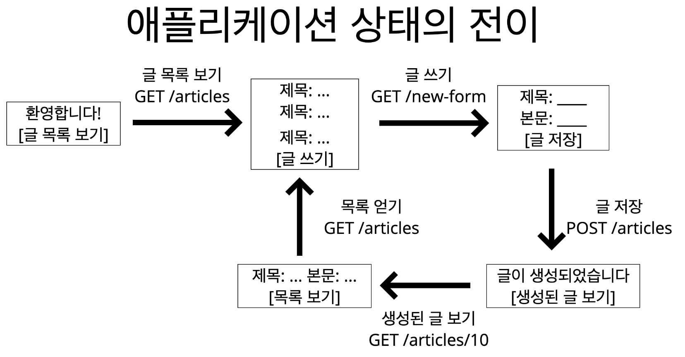
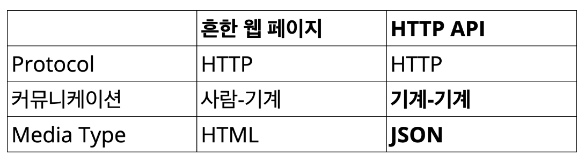
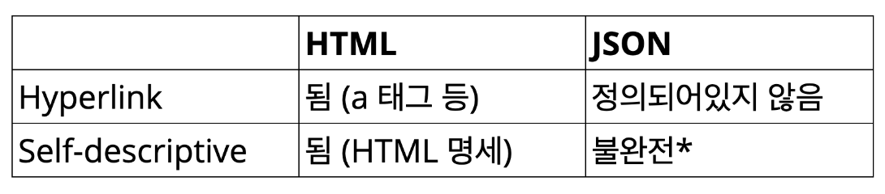

# 그런 REST API로 괜찮은가
[그런 REST API로 괜찮은가](https://www.youtube.com/watch?v=RP_f5dMoHFc)라는 영상을 보고 정리한 글입니다.

## REST
**RE**presentational **S**tate **T**ransfer

> A way of providing interoperability between computer systems on the internet (출처:위키백과)

이게 무슨 말이지...?

### REST API란?
REST 아키텍쳐 스타일을 따르는 API이다.

### REST란?
분산 하이퍼미디어 시스템(예:web)을 위한 아키텍쳐 스타일이다.

### 아키텍쳐 스타일이란?
제약 조건들의 집합이다.

#### 즉, 제약조건들을 **모두** 지켜야 REST를 따르는 것이라 말할 수 있다.

### REST의 제약조건
- client-server
- stateless
- cache
- **uniform interface**
- layered system
- code-on-demand (optional)
    - 서버에서 코드를 클라이언트로 보내서 실행할 수 있어야 한다. (Javascript)

이미 HTTP만 잘 따라도 **대부분** 잘 지킬 수 있다. 그런데 그 중, **uniform interface**라는 것은 잘 지키지 못한다.

### Uniform Interface의 제약조건
1) identification of resources
    - 리소스가 URI로 식별되어야 함
2) manipulation of resources through representations
    - representation 전송을 통해 리소스를 조작해야 함
3) **self-descriptive messages**
4) **hypermedia as the engien of application state (HATEOAS)**

1, 2는 잘 지켜지고 있으나 **3, 4**는 잘 지켜지지 않는다.

#### Self-Descriptive messages
메시지는 스스로를 온전히 설명해야 한다.

``` bash
GET / HTTP/1.1
```

위와 같은 경우는 Self-Descriptive하지 않다. 목적지가 빠져있기 때문이다.

```bash
Get / HTTP/1.1

Host: www.example.org
```
이렇게 되면 Self-Descriptive하다.

한가지 경우를 더 살펴보자.
```bash
HTTP/1.1 200 OK
[ { "op": "remove", "path": "/a/b/c" } ]
```

위와 같은 경우도 Self-Descriptive하지 않다.

어떤 문법으로 작성된 것인지 명시되지 않았기 때문이다.

```bash
HTTP/1.1 200 OK
Content-Type: application/json
[ { "op": "remove", "path": "/a/b/c" } ]
```

이제야 문법이 명시되었기 때문에 client 쪽에서 파싱이 가능하게 되었다.

하지만 아직 Self-Descriptive하지 않다.

`op`와 `path` 같은 것들이 불명확하기 때문이다.

```bash
HTTP/1.1 200 OK
Content-Type: application/json-patch+json
[ { "op": "remove", "path": "/a/b/c" } ]
```

비로소 Self-Descriptive하게 되었다.

#### HATEOAS
애플리케이션의 상태는 Hyperlink를 통해 항상 전이되어야 한다.



위와 같이 모든 페이지가 링크로 연결될 수 있는 것이 HATEOAS이다.

HTML은 HATEOAS를 만족한다.
```bash
HTTP/1.1 200 OK
Content-Type: text/html

<html>
<head></head>
<body><a href="/test"></a></body>
</html>
```
`a` 태그를 통해서 하이퍼링크가 나와있고, 이를 통해 전이될 수 있기 때문이다.

json 표현을 통해서도 만족할 수 있는 방법이 있다.
```bash
HTTP/1.1 200 OK
Content-Type: application/json
Link: </articles/1>; rel="previous",
      </articles/3>; rel="next";
{
    "title": "The second article",
    "contents": "blah ... "
}
```
`Link`라는 헤더를 통해 연결되어 있는 다른 리소스를 가리킬 수 있다.

이미 표준으로 링크 양식에 대해 나와있기 때문에 모두가 이해할 수 있다. 

고로, HATEOAS를 만족한다.

### 왜 Uniform Interface를 만족해야 하나?
**독립적 진화**
- 서버와 클라이언트가 각각 독립적으로 진화한다.
- **서버의 기능이 변경되어도 클라이언트를 업데이트할 필요가 없다.**
- REST를 만들게 된 계기: *"How do I improve HTTP without breaking the Web"*
    - **웹이 깨지지 않는 선**에서 어떻게 HTTP를 향상시킬지에 대한 고민

#### 그래서 실제로 REST가 잘 지켜지고 있는 대표적 사례
**웹**
- 웹 페이지의 변경으로 인해 웹 브라우저를 업데이트할 필요가 없다.
- 웹 브라우저의 업데이트로 인해 웹 페이지를 변경할 필요도 없다.
- HTTP 명세가 변경되어도 웹은 잘 동작한다.
- HTML 명세가 변경되어도 웹은 잘 동작한다.

#### 어떻게?
수많은 사람들의 엄청난 노력
- HTML5 첫 초안에서 권고안 나오는데까지 **6년**
- HTTP/1.1 명세 개정판 작업하는데 **7년**

#### 왜 이렇게까지?
상호운용성(interoperability)을 집착 수준으로 지켜내기 위해서!

### 그래서 REST가 웹의 **독립적 진화**에 도움을 줬는가?
그럼!
- HTTP에 지속적으로 영향을 줌
- Host 헤더 추가
- 길이 제한을 다루는 방법이 명시 (414 URI Too Long 등)
- URI에서 리소스의 정의가 추상적으로 변경
- 기타 HTTP와 URI에 많은 영향을 줌
- HTTP/1.1 명세 최신판에서 REST에 대한 언급이 들어감


### 그래서 REST의 목표는 성공적?
성공했다!

REST는 웹의 독립적 진화를 위해 만들어졌고, 웹은 독립적으로 진화하고 있기 때문이다.

### 그런데 REST **API**는?
- REST API는 REST 아키텍쳐 스타일을 따라야 한다.
- 그런데 오늘날 스스로 REST API라고 하는 대부분의 API들이 REST 아키텍쳐 스타일을 **따르고 있지 않다**.


### 왜 API는 일반적인 웹에 비해 REST가 잘 안되는가?



커뮤니케이션의 **주체**가 다르다보니 **Media Type**이 다를 수 밖에 없다.


`JSON`으로 인해 차이가 생긴다.
- 따로 Hyperlink를 걸 수 있는 것이 정의되지 않았다.
    - **HATEOAS**의 실패
- JSON 객체 안에 들어갈 수 있는 key-value에 대해 명시되지 않았다.
    - **Self-Descriptive**의 실패

즉 문법 해석은 가능하지만, 의미를 해석하려면 별도의 문서(API 문서)가 필요하다!

### 그런데 잠깐만, 이 두 조건이 독립적 진화에 어떻게 도움이 될까?

#### Self-Descriptive
- 확장 가능한 커뮤니케이션
- 서버나 클라이언트가 변경되더라도 메시지는 언제나 해석 가능하다.

#### HATEOAS
- 애플리케이션 상태 전이의 late binding이 가능하다.
- 링크를 동적으로 변경할 수 있다.

### OK, 그럼 REST API를 만족시키려면?
- **Self-Descriptive**
    - custom media type
    - profile link relation
- **HATEOAS**
    - HTTP 헤더나 본문에 링크를 담는다

## Conclusion
- 오늘날 대부분의 REST API는 사실상 REST를 따르고 있지 않다.
- 특히, **Self-Descriptive**와 **HATEOAS**를 대부분 만족하지 못한다.
- REST를 따를 것인지에 대한 여부는 API를 설계하는 이들이 판단하여 결정하면 된다.
- REST를 따르겠다면, 몇가지 방법을 통해 **Self-Descriptive**와 **HATEOAS**를 만족시켜야 한다.


# Reference
[그런 REST API로 괜찮은가](https://www.youtube.com/watch?v=RP_f5dMoHFc)

[Slides](https://slides.com/eungjun/rest#/)